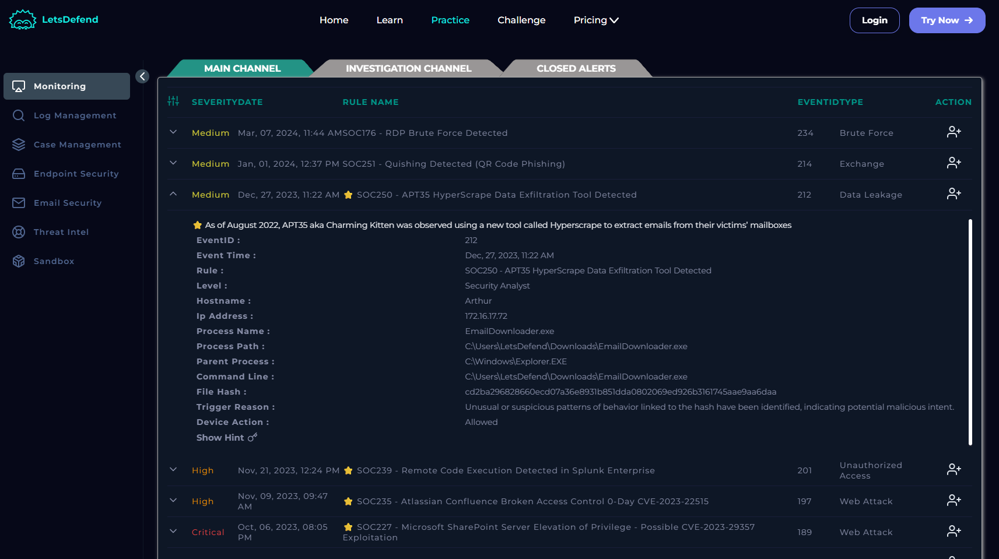

# -SOC250-APT35-HyperScrape-Data-Exfiltration-Tool-Detected

# 🛡️ APT35 HyperScrape Detection Report

## 📌 Overview

This README documents a security incident involving the detection of the **APT35 (Charming Kitten) HyperScrape tool**. The tool was identified on a host machine via suspicious activity and hash-based detection.

---

## 🚨 Incident Details

* **Alert Title:** SOC250 - APT35 HyperScrape Data Exfiltration Tool Detected
* **Severity:** Medium
* **Event ID:** 212
* **Date & Time:** Dec 27, 2023, 11:22 AM
* **Category:** Data Leakage

### 🎯 Threat Context

APT35, also known as Charming Kitten, is a nation-state threat actor linked to Iran(or Iranian state). As of **August 2022**, this group was observed deploying a custom tool named **HyperScrape** to extract contents from victims’ webmail accounts (Gmail, Yahoo, Outlook). Some of this actions involves, **logging into victims' web-based email accounts**, **downloading inbox content(emails, attachments)**, later **delecting messages to cover thier tracks** and **bypassing weak security controls whrn 2FA is not enabled**. This tool, HyperScrape is designed to interact with webmail interfaces through an automated browser session like a headless Chrome browser.

---

## 💻 Affected System

* **Hostname:** Arthur
* **IP Address:** 172.16.17.72
* **Process Name:** `EmailDownloader.exe`
* **Process Path:** `C:\Users\LetsDefend\Downloads\EmailDownloader.exe`
* **Parent Process:** `C:\Windows\Explorer.EXE`
* **Command Line:** `C:\Users\LetsDefend\Downloads\EmailDownloader.exe`

### 🔐 File Hash (SHA-256):

`cd2ba296828660ecd07a36e8931b851dda0802069ed926b3161745aae9aa6daa`

---

## 🚨 Trigger Reason

Behavioral analysis and hash reputation checks identified suspicious patterns linked to the execution of `EmailDownloader.exe`, consistent with HyperScrape activity. The tool is known to:

* Log into victim accounts using stolen credentials
* Download inbox content
* Delete messages post-exfiltration

---

## 📦 Device Response

**Device Action:** Allowed
⚠️ No automatic remediation occurred at the time of detection.

---

---
## 🛡️ Recommendations

1. **Immediately isolate the endpoint** to prevent further exfiltration.
2. **Revoke and reset all email credentials** used on the affected system.
3. **Scan the system for persistence mechanisms** and related malware.
4. **Enable 2FA** on associated email accounts.
5. **Block the hash and associated IOCs** in your EDR/Firewall solutions.

---

## 📚 Reference

* [Google TAG on HyperScrape](https://blog.google/threat-analysis-group/charming-kitten-uses-new-tool-exfiltrate-email/)

> This documentation is part of an ongoing effort to monitor and respond to APT-based threats in a SOC environment.
