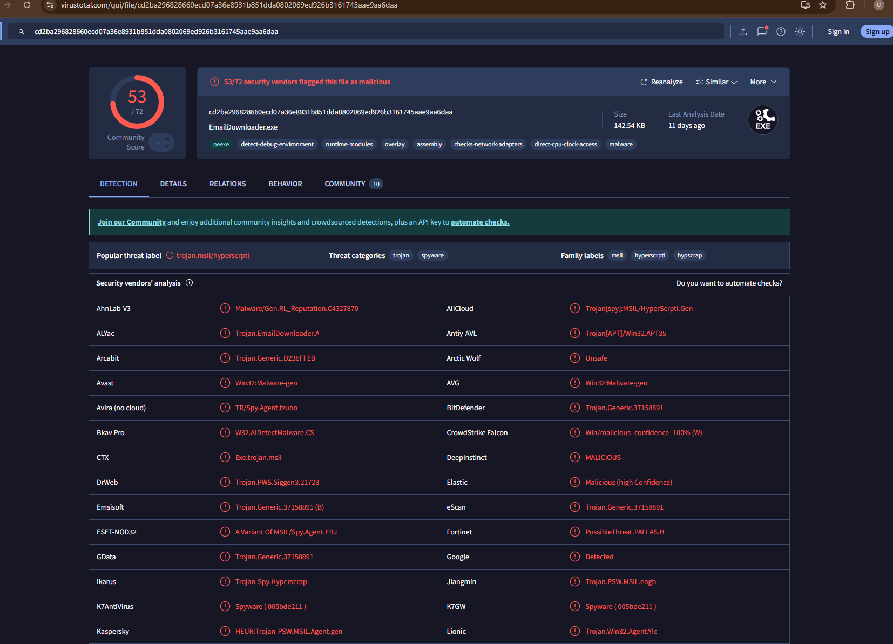
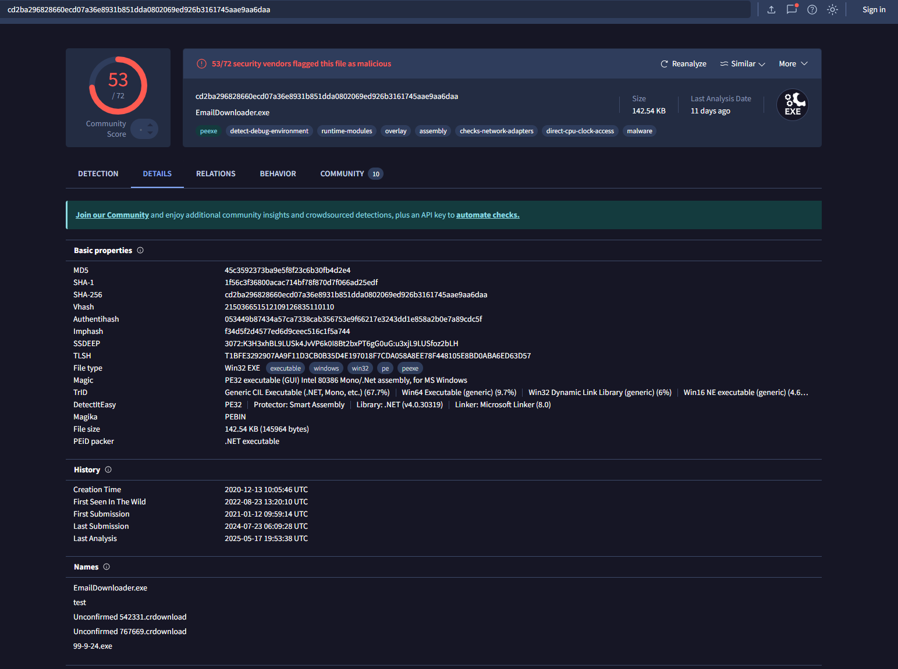
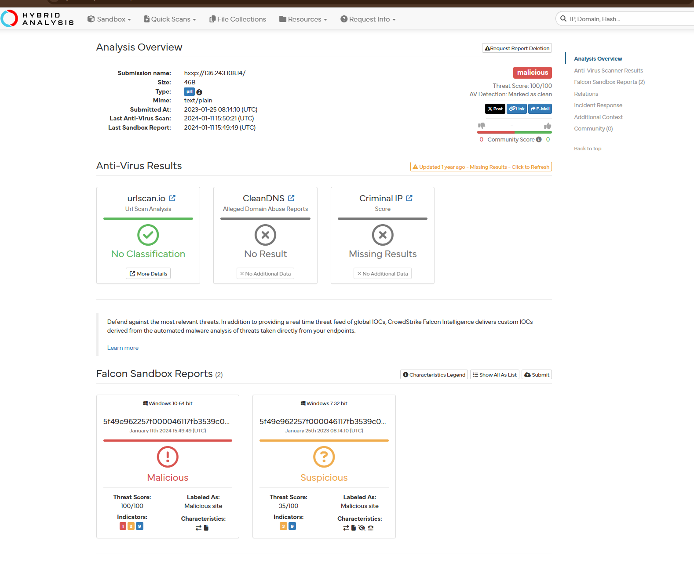
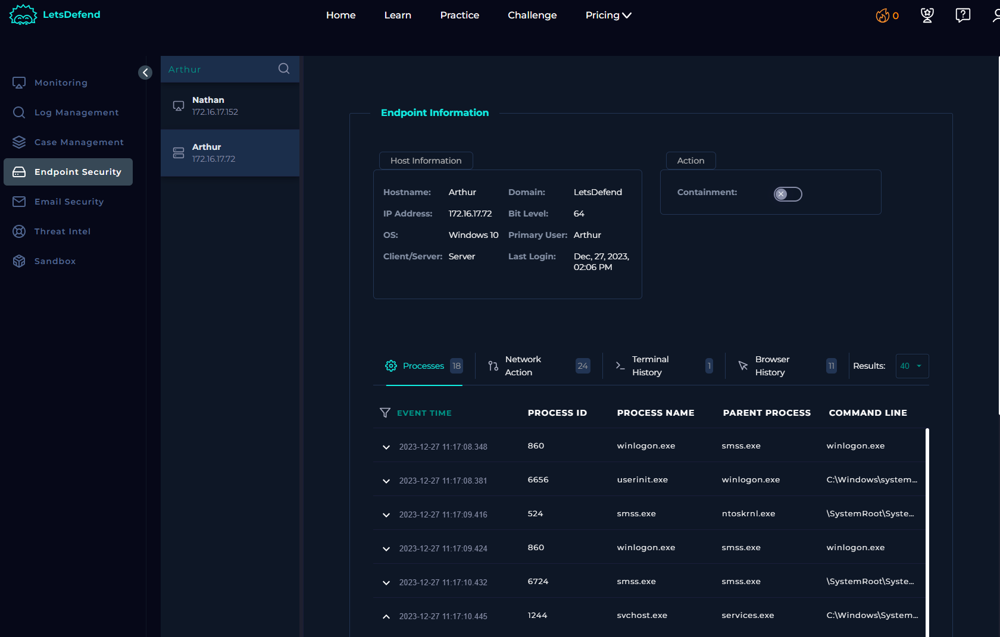
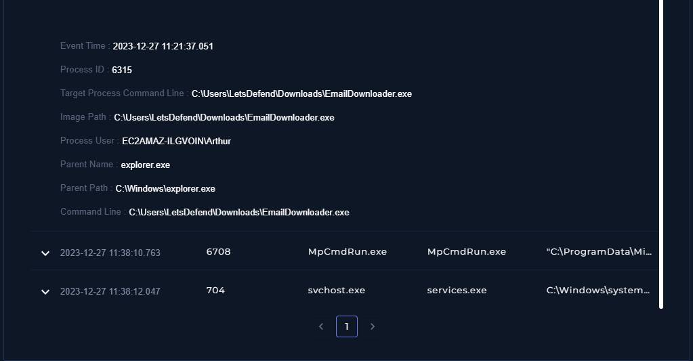
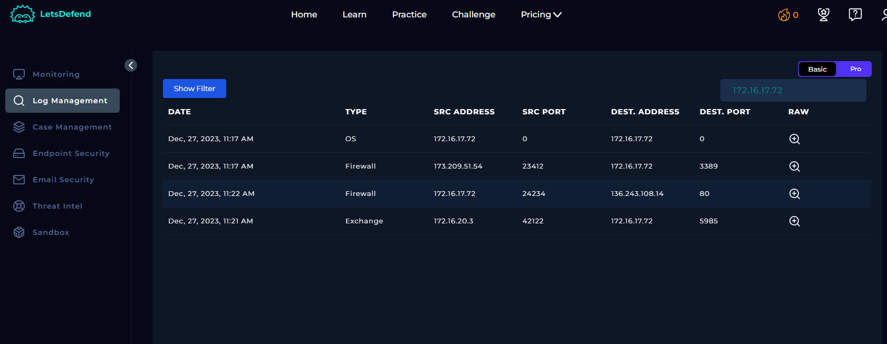
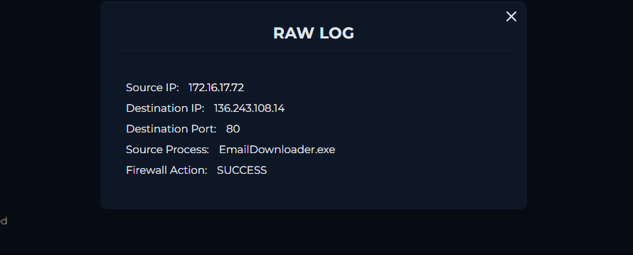

# -SOC250-APT35-HyperScrape-Data-Exfiltration-Tool-Detected

# 🛡️ APT35 HyperScrape Detection Report

## 📌 Overview

This README documents a security incident involving the detection of the **APT35 (Charming Kitten) HyperScrape tool**. The tool was identified on a host machine via suspicious activity and hash-based detection.

---

## 🚨 Incident Details

* **Alert Title:** SOC250 - APT35 HyperScrape Data Exfiltration Tool Detected
* **Severity:** Medium
* **Event ID:** 212
* **Date & Time:** Dec 27, 2023, 11:22 AM
* **Category:** Data Leakage

### 🎯 Threat Context

APT35, also known as Charming Kitten, is a nation-state threat actor linked to Iran(or Iranian state). As of **August 2022**, this group was observed deploying a custom tool named **HyperScrape** to extract contents from victims’ webmail accounts (Gmail, Yahoo, Outlook). Some of this actions involves, **logging into victims' web-based email accounts**, **downloading inbox content(emails, attachments)**, later **delecting messages to cover thier tracks** and **bypassing weak security controls whrn 2FA is not enabled**. This tool, HyperScrape is designed to interact with webmail interfaces through an automated browser session like a headless Chrome browser.

---

## 💻 Affected System

* **Hostname:** Arthur
* **IP Address:** 172.16.17.72
* **Process Name:** `EmailDownloader.exe`
* **Process Path:** `C:\Users\LetsDefend\Downloads\EmailDownloader.exe`
* **Parent Process:** `C:\Windows\Explorer.EXE`
* **Command Line:** `C:\Users\LetsDefend\Downloads\EmailDownloader.exe`

### 🔐 File Hash (SHA-256):

`cd2ba296828660ecd07a36e8931b851dda0802069ed926b3161745aae9aa6daa`

---

## 🚨 Trigger Reason

Behavioral analysis and hash reputation checks identified suspicious patterns linked to the execution of `EmailDownloader.exe`, consistent with HyperScrape activity. The tool is known to:

* Log into victim accounts using stolen credentials
* Download inbox content
* Delete messages post-exfiltration

---

## 📦 Device Response

**Device Action:** Allowed
⚠️ No automatic remediation occurred at the time of detection.

---
## aLERT ON lETSDEFEND

---

## HOW I TACKLED, SOLVE AND RESOLVE THE ALERT

Search the Hash for more details about the file hash `cd2ba296828660ecd07a36e8931b851dda0802069ed926b3161745aae9aa6daa` on VirusTotal

Search show that the hash file with the name EmailDownloader.exe has a 53/72 malicious community score which is pretty intense. 

This score were from security vendors like **Avast**, **K7Antivirus**, **Kaspersky**, **Tencent** and many more.

Other Detail include their HTTP Requests and IP Traffic

I've also gained the IP address of the Theat actor `136.243.108[.]14` which i can search on **Hybrid Analysis** as well. 

IP has being flaged by Hybrid Analysis as **Malicious**

We've gathered enough information about the hash and IP. Lets dive into our Clients endpoint to see what commands were exercuted.

I searched the Clients name **Arthur** on the endpoint Security

Went through all the 18 processes and found the EmailDownloader.exe with an Image path: `C:\Users\LetsDefend\Downloads\EmailDownloader.exe`

Inspected the Log Management as well, where there is a comfirmation on communication between the client and the malicious IP 

---

On December 27, 2023, at 11:22 AM, alert SOC250 was triggered on host Arthur, identifying activity linked to the APT35 HyperScrape tool, a known data exfiltration utility used by Iranian threat actor Charming Kitten. The tool, identified as EmailDownloader.exe, was executed from the user’s Downloads directory, with parent process Explorer.EXE. The behavior and hash of the file (SHA-256: cd2ba2968..., MD5: 45c3592373ba9e5f8f23c6b30fb4d2e4) matched known-malicious indicators. The command line showed direct execution without obfuscation. Notably, the sample appeared under several names, including EmailDownloader.exe, 99-9-24.exe, and partially downloaded files like Unconfirmed 542331.crdownload, indicating possible browser-based delivery or staging.

Network telemetry showed the destination IP as 136.243.108.14, a known malicious server likely used for command and control (C2) or exfiltration. HyperScrape typically automates login to victims' webmail, extracts emails, and removes traces by deleting inbox messages. The execution on this host suggests credential theft or phishing was likely used for initial access. Though no endpoint prevention occurred at the time (device action: "Allowed"), post-alert actions confirmed the threat was contained, preventing further compromise or outbound data loss.

Immediate remediation included isolating the endpoint, revoking user credentials, and scanning for persistence mechanisms or lateral movement. DNS and proxy logs should be reviewed for communication with the malicious IP or similar behavior across the environment. To prevent recurrence, enabling multi-factor authentication (MFA), restricting downloads of executable files from browsers, and updating endpoint protection policies are strongly recommended. This event highlights the ongoing risk of nation-state actors targeting email access and user data via custom exfiltration tools.

---
## 🛡️ Recommendations

1. **Immediately isolate the endpoint** to prevent further exfiltration.
2. **Revoke and reset all email credentials** used on the affected system.
3. **Scan the system for persistence mechanisms** and related malware.
4. **Enable 2FA** on associated email accounts.
5. **Block the hash and associated IOCs** in your EDR/Firewall solutions.

---

## 📚 Reference

* [Google TAG on HyperScrape](https://blog.google/threat-analysis-group/charming-kitten-uses-new-tool-exfiltrate-email/)

> This documentation is part of an ongoing effort to monitor and respond to APT-based threats in a SOC environment.
